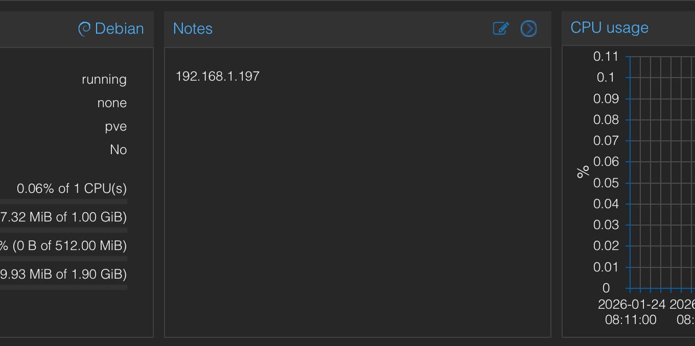

# Proxmox IP Notes

A lightweight, zero-config utility that automatically prepends the IP address of LXC containers and Virtual Machines to their "Notes" field in Proxmox upon startup.



## Features

*   **Zero-Config Automation**: Automatically detects when any container or VM starts and updates its notes. No need to manually add hookscripts to every machine.
*   **Duplicate Prevention**: Smartly checks if the IP is already present to keep your notes clean and readable.
*   **Supports Static & DHCP**: Works for machines with static IPs in their config *and* machines that grab an IP via DHCP.
*   **Handles Multi-Line Notes**: Preserves your existing descriptions and simply adds the IP at the top.

## How it Works

Unlike heavy polling scripts that scan all your machines every minute, this tool is **Event-Driven**.

1.  **The Watcher**: A tiny systemd service monitors the Proxmox `journal` in real-time. It sits idle (0% CPU) until it sees a specific "Started" event.
2.  **The Trigger**: When a machine starts (e.g., `Started pve-container@100.service`), the watcher wakes up and triggers the updater for *only* that specific ID.
3.  **The Update**: It waits 10-30 seconds (to allow DHCP to assign an IP) and then writes the IP to the machine's config.

## Installation

1.  **Download the files** to your Proxmox host:
    ```bash
    git clone https://github.com/saihgupr/proxmox-ip-notes.git
    cd proxmox-ip-notes
    ```

2.  **Move scripts to the system path**:
    ```bash
    cp ip-notes /usr/local/bin/
    cp proxmox-auto-ip-notes /usr/local/bin/
    chmod +x /usr/local/bin/ip-notes /usr/local/bin/proxmox-auto-ip-notes
    ```

3.  **Install the Service**:
    ```bash
    cp proxmox-ip-notes.service /etc/systemd/system/
    systemctl daemon-reload
    systemctl enable --now proxmox-ip-notes
    ```

## Manual Usage

You can also run the tool manually at any time to bulk-update every machine on your host:

```bash
ip-notes
```

## Requirements
*   **Proxmox VE 7.x or 8.x**
*   **QEMU Guest Agent** (Required for VMs to report their IP)
